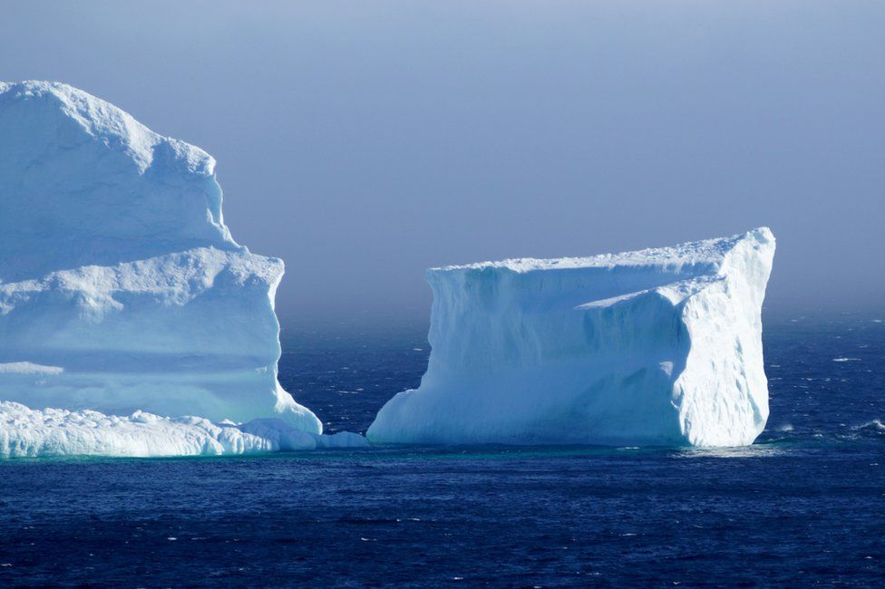

Satellite imagery is rapidly transforming the way we see the planet, including our ability to study the most remote parts of the Arctic and Antarctic. Satellite imagery can help us map networks of rivers, study changes in the flow and thickness of glaciers, identify rock and soil types, and even find animals like penguins and seals. Because the availability of imagery in polar areas has increased rapidly over the last decade, we are now faced with a challenge: How do we scale-up the scientific discoveries that have been enabled by satellite imagery to larger spatial scales? Moving from small pilot-studies to pan-Arctic or pan-Antarctic analyses of geological and biological processes requires new infrastructure to link scientists, satellite imagery, and high performance computers. This new imagery-computing superhighway will make it easier for scientists to study processes at much larger spatial scales than has been previously possible. Our project, called ICEBERG — Imagery Cyberinfrastructure and Extensible Building-Blocks to Enhance Research in the Geosciences, aims to build the cyberinfrastructure required to make the most of satellite imagery for geosciences, starting with researcher working in polar areas, where much of this science is already underway, and then branching out to the entire EarthCube community. 

ICEBERG is supported by the NSF EarthCube program [1740595](https://www.nsf.gov/awardsearch/showAward?AWD_ID=1740595&HistoricalAwards=false). More information about our project and its relationship to EarthCube can be found at our [EarthCube site](https://www.earthcube.org/group/iceberg-imagery-cyberinfrastructure-extensible-building-blocks-enhance-research-geosciences).

